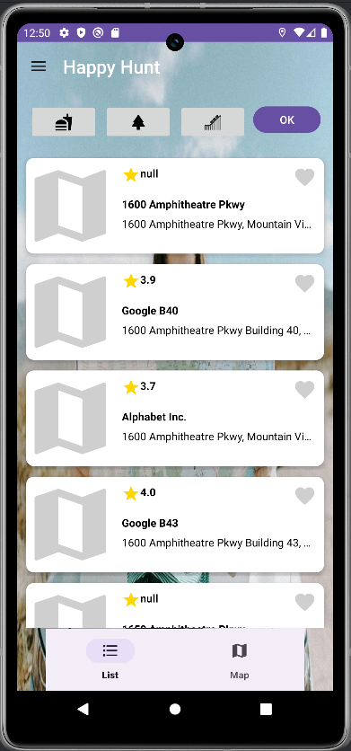
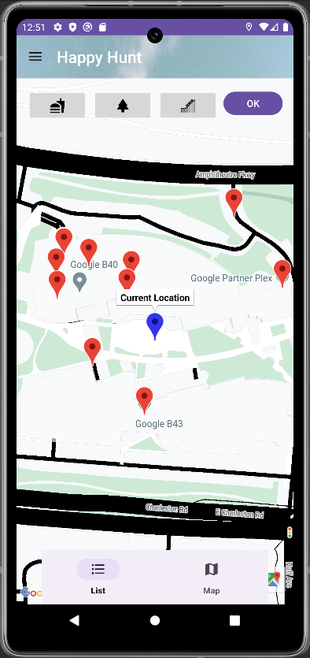
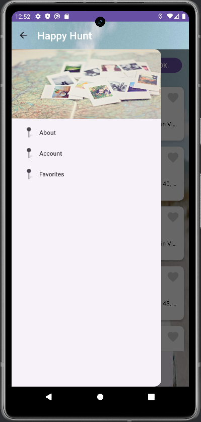
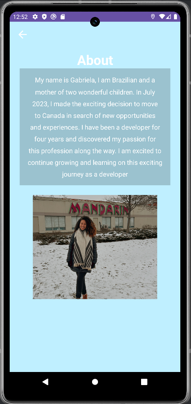
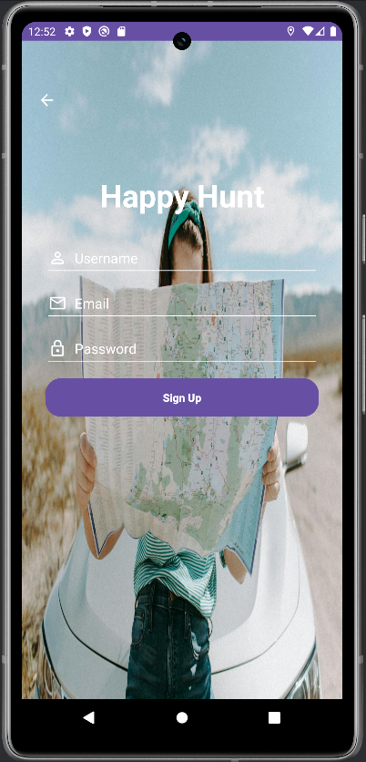
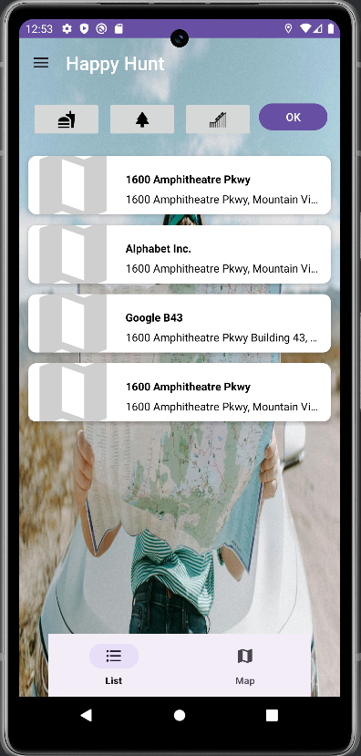
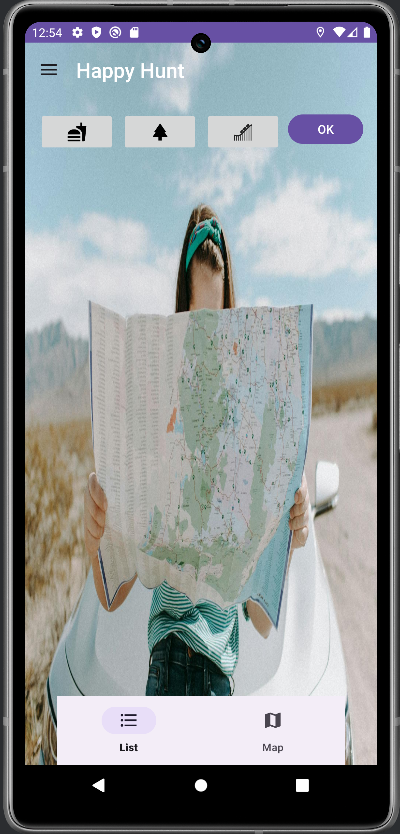

# **Happy Hunt**

## **Introduction**

Happy Hunt is a mobile application developed as part of the Mobile Development - Android course in the Mobile Solutions postgraduate program. The app is designed to help users find parks, restaurants, and other places based on their location.

## **Getting Started**

To get started with the Happy Hunt app, follow these steps:

1. **Configure API Key:**
   - Open the `app/src/main/res/values/google_api_key.xml` file in your project.
   - Replace the placeholder text with your actual Google API key. This is required because the app uses the Google Nearby Places API.

## **Screenshots**

