<div align="center">

# Happy Hunt

**Find something fun nearby: parks, playgrounds, treats, food and things to see. Built with Kotlin, Jetpack Compose and OpenStreetMap.**

Open it, let it see where you are (or pick an area) and the map fills with
colour: green for parks, amber for playgrounds, pink for coffee and treats.
No account, no sign-up, no API key.

[Features](#features) · [Screenshots](#screenshots) · [Run it](#run-it) · [Architecture](#architecture) · [Tests](#tests)

</div>

---

<div align="center">
  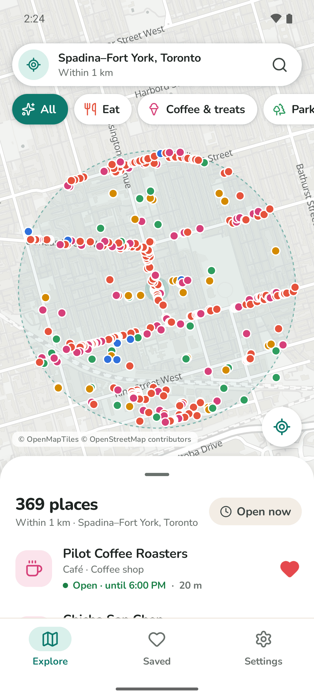
  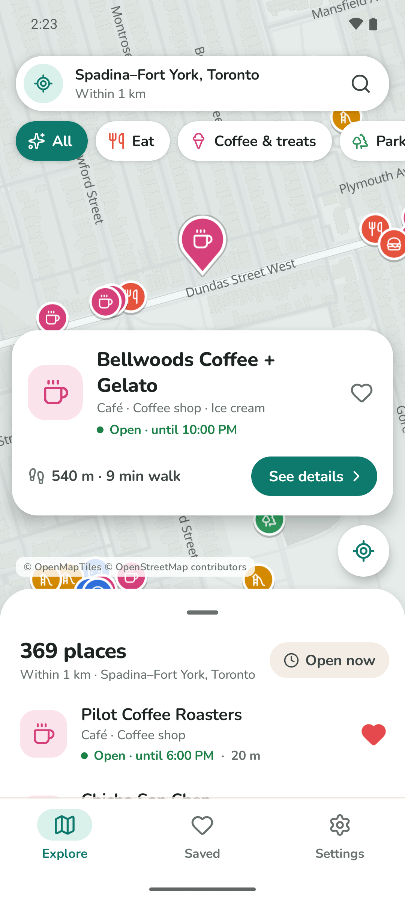
  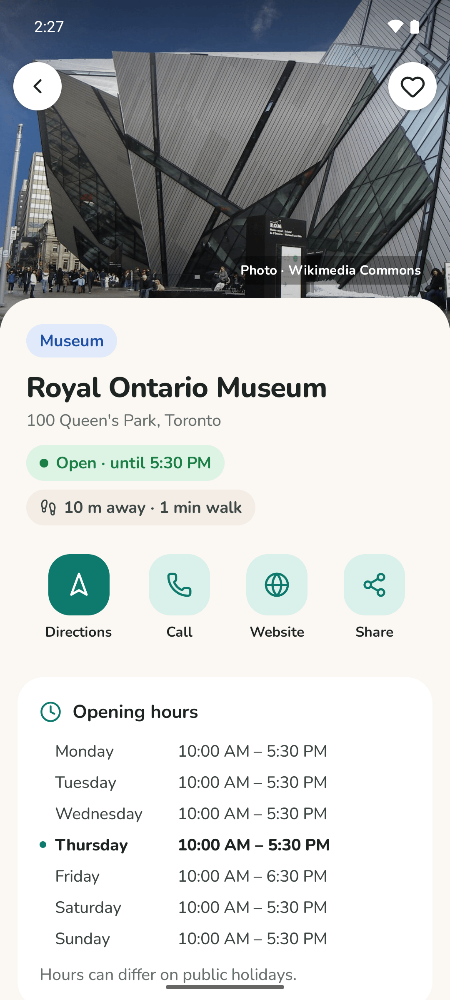
</div>

## What this is

Happy Hunt is for the moment someone asks "what should we do?". It shows
what is around: somewhere to eat, a café, a park, a playground for the kids, a
museum, a mini golf. For each place it shows whether it is open right now and
how long the walk is.

It started as a project for the Mobile Development – Android course in the
Mobile Solutions postgraduate program. That version was a Java app with
sign-up and login screens, an About page for the course, and the Google Places
API behind a key each developer had to supply. It has since been rebuilt from
scratch as a portfolio piece, in Kotlin and Jetpack Compose. The accounts are
gone on purpose: an app for finding a park should not ask anyone to sign up
first. The places now come from OpenStreetMap, so it runs without any key.

## Features

**Exploring**
- A full-screen map of the area, with every place as a dot in its category's
  colour, so a street of restaurants or a cluster of parks shows at a glance.
  Zoom in and the dots become pins with an icon for each kind of place: coffee,
  croissant, gelato, slide, museum, theatre, zoo and more
- Six kinds of outing: Eat, Coffee & treats, Parks, Playgrounds, Things to do
  (attractions, zoos, mini golf, arcades, viewpoints) and Museums & culture
- A list under the map, sorted by distance, that pulls up to fill the screen.
  Each row shows whether the place is open, until when, and how far away it is
- **Open now** narrows everything to what is open this minute. Parks and
  playgrounds with no listed hours count as open, as they almost always are
- Tap a place on the map for a card with its status and walking time, then
  **See details**
- Move the map and **Search this area** looks there instead. Look within
  500 m, 1 km, 2 km or 5 km, in kilometres or miles

**A place**
- A photo when Wikimedia Commons has one (museums, landmarks, big parks),
  otherwise a bright banner in the place's colours
- Directions in the phone's maps app, call, website and share, shown only when
  the place has them
- The week's opening hours with today highlighted, and a plain "not listed"
  rather than a guess when there are none
- Good to know: wheelchair access, free entry, outdoor seating, vegan or
  vegetarian options, takeaway, dogs welcome, baby changing, toilets, Wi-Fi,
  playground ages
- A small map, and a link to fix the place on OpenStreetMap if anything is
  wrong

**Saved places**
- A heart on every place. Saved places keep a full copy of their details, so
  the Saved tab works offline and a place stays even if it leaves the map
- Swipe a saved place away, with Undo, and filter them by kind

**Finding an area**
- Use the phone's position, or search for a neighbourhood, a city, a park or an
  address, with the last five areas one tap away

**Everything else**
- Light and dark themes, following the phone or set by hand, with a dark map
  to match
- Friendly states for every case: searching, nothing found (with a nudge to
  look further), nothing open, offline, or busy map servers
- Searches are kept for a day, so going back to an area is instant and still
  works without a connection

## Screenshots

<table>
  <tr>
    <td align="center">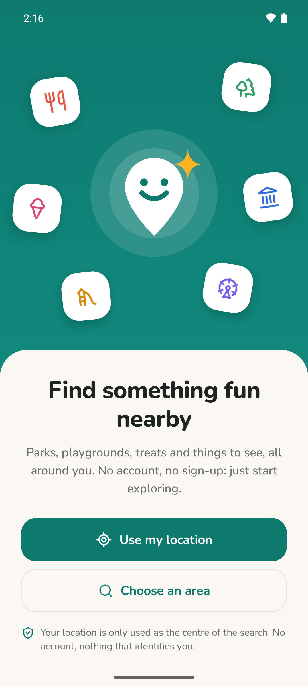<br><sub>Welcome</sub></td>
    <td align="center"><br><sub>Explore</sub></td>
    <td align="center">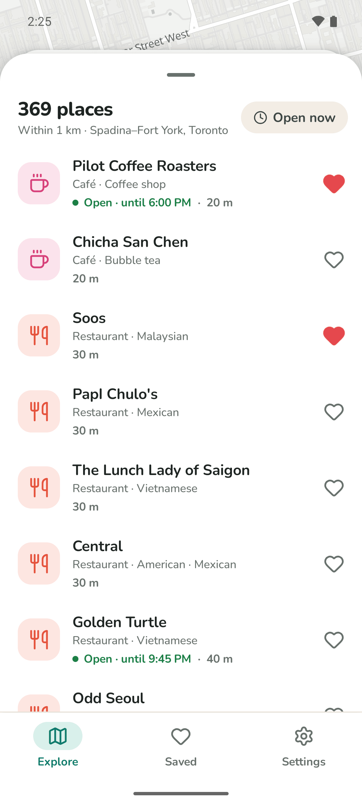<br><sub>The list</sub></td>
  </tr>
  <tr>
    <td align="center"><br><sub>On the map</sub></td>
    <td align="center">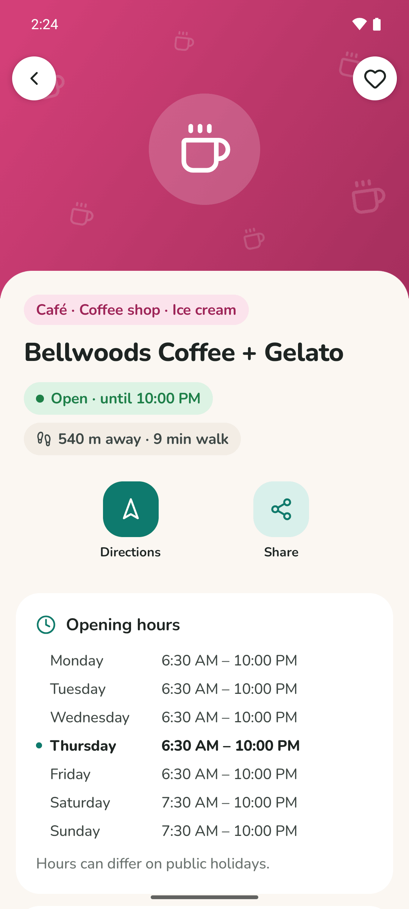<br><sub>A café</sub></td>
    <td align="center"><br><sub>A museum</sub></td>
  </tr>
  <tr>
    <td align="center">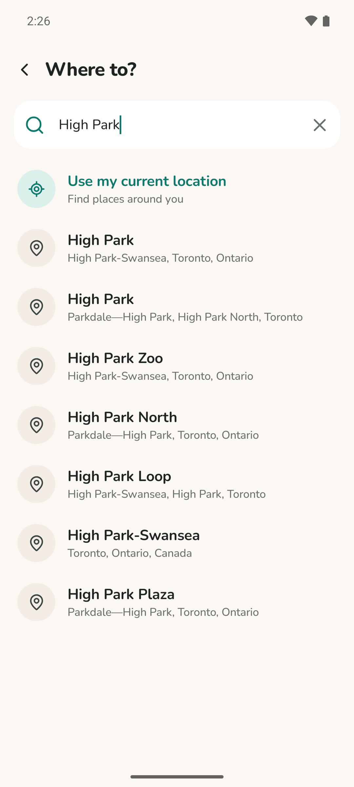<br><sub>Choose an area</sub></td>
    <td align="center">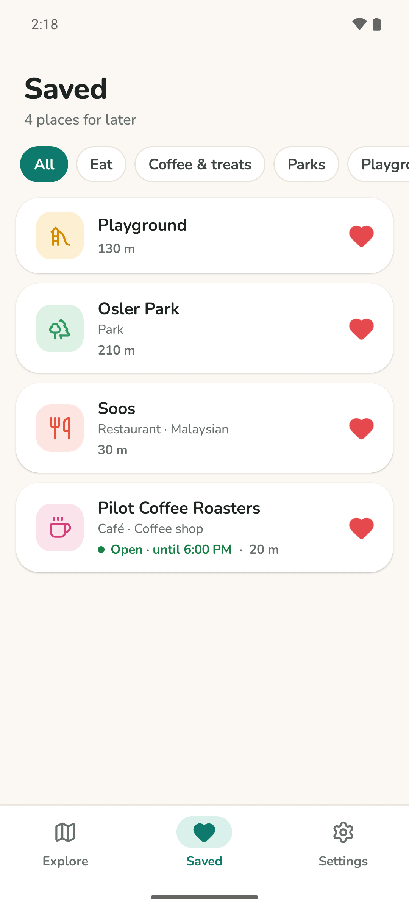<br><sub>Saved</sub></td>
    <td align="center">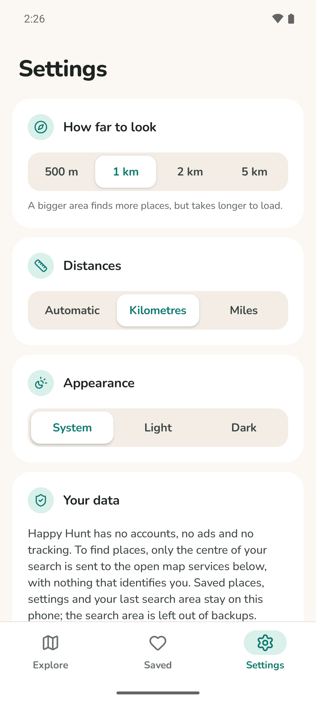<br><sub>Settings</sub></td>
  </tr>
</table>

**Dark mode**

<table>
  <tr>
    <td align="center">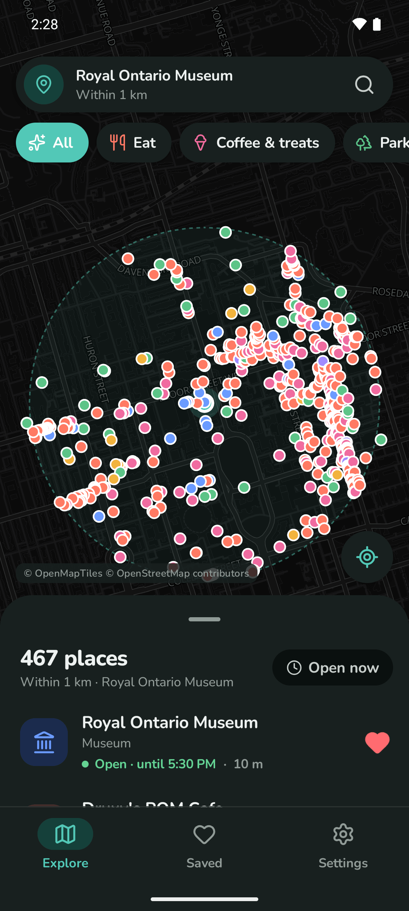<br><sub>Explore</sub></td>
    <td align="center">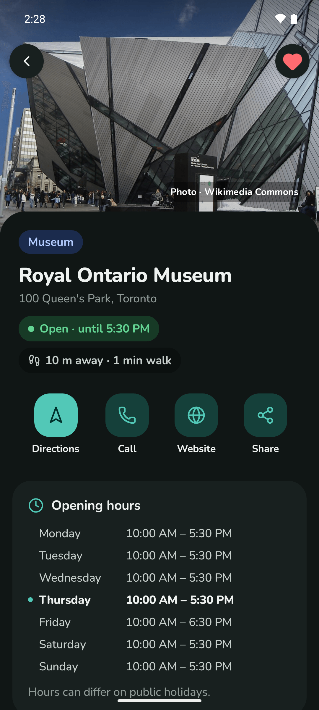<br><sub>A place</sub></td>
    <td align="center">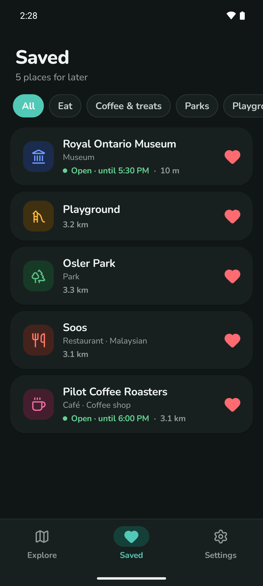<br><sub>Saved</sub></td>
  </tr>
</table>

## Design

- **Colour.** Lagoon teal for the app itself and a sunny yellow for its
  sparkle, on a warm cream. Each kind of outing has its own bright colour,
  used on the map, the list tiles and the place banners: tomato for food,
  berry for treats, leaf green for parks, amber for playgrounds, grape for
  things to do, ocean blue for culture. Open, closing soon and closed have
  their own green, amber and red. Dark mode has its own palette rather than
  inverted colours.
- **Type.** [Nunito](https://fonts.google.com/specimen/Nunito) throughout, a
  rounded typeface that suits a friendly app and stays readable at small sizes.
- **Icons.** [Lucide](https://lucide.dev) line icons, plus a slide drawn in the
  same style because Lucide has no playground. The map draws its pins from the
  same icons.
- **The map.** [OpenFreeMap](https://openfreemap.org)'s Positron and Dark
  styles: quiet, grey maps that let the coloured places stand out.
- **Motion.** The welcome pin bobs, hearts bounce when tapped, the place card
  slides up, and the controls above the list fade away as it is pulled up.
- **Accessibility.** Icon buttons have spoken descriptions, chips and choices
  say when they are selected, and touch targets are at least 48 dp.

## Privacy

There are no accounts, no ads and no analytics. To find places, the app sends
the centre of the search (the phone's position, or the area picked) to the
open services listed under [Credits](#credits), with a User-Agent that names
the app and nothing that identifies the person. Saved places, settings and the
last search area stay on the phone. The search area is left out of Android
backups. Location permission is asked for only when you ask to use your
location, and approximate location is enough.

## Tech stack

- **Kotlin 2.4** and **Jetpack Compose** with Material 3
- Built with the **Android Gradle Plugin 9** and **Gradle 9**
- **MapLibre Native** for the map, with OpenFreeMap vector tiles: no key and no
  tracking
- **Overpass API** to find places in OpenStreetMap, **Photon** to search for
  areas, and **Wikidata** and **Wikimedia Commons** for photos
- **OkHttp**, **kotlinx.serialization** and **Coil 3**
- **Navigation Compose** with type-safe routes
- **ViewModel** and **StateFlow**, collected with lifecycle awareness
- **Room** (with KSP) for saved places, **DataStore** for settings
- The platform location service through `LocationManagerCompat`, so there is
  no Google Play services dependency
- **JUnit 4** tests on the JVM, with **MockWebServer** for the network code
- **GitHub Actions** runs the unit tests and lint and builds a debug APK on
  every push

## Run it

You need an Android Studio recent enough for the Android Gradle Plugin 9.4,
or JDK 17 or newer with the Android SDK 37. The app runs on Android 10 (API 29)
and up, and targets Android 17 (API 37). There is nothing to configure: no API
key, no account, no server.

```bash
git clone https://github.com/gabrielapereira15/HappyHunt_V2.git
cd HappyHunt_V2
./gradlew installDebug      # with a device or emulator connected
```

Or open the folder in Android Studio and press Run.

On an emulator, set a location before tapping **Use my location**, from the
emulator's Extended controls or with
`adb emu geo fix -79.4197 43.6465` (longitude first; that is Trinity Bellwoods
in Toronto). Or skip location entirely: **Choose an area** and search for any
place.

### Commands

```bash
./gradlew testDebugUnitTest   # unit tests
./gradlew lintDebug           # Android lint
./gradlew assembleDebug       # app/build/outputs/apk/debug/app-debug.apk
```

## Architecture

```
app/src/main/java/com/example/happyhunt/
├── domain/          Places and their kinds, opening hours, distances, and the
│                    Overpass and Photon parsers. No Android code
├── data/            The Overpass, Photon and Wikidata clients, saved places
│                    (Room), settings (DataStore) and the phone's location
├── ui/
│   ├── theme/       Colours, type, shapes and icons
│   ├── map/         The MapLibre map in Compose, its layers and marker images
│   ├── components/  Place rows, hearts, status pills, messages
│   └── welcome/ explore/ search/ place/ saved/ settings/
├── AppContainer.kt  Builds the repositories once for the whole app
├── HappyHuntApp.kt
└── MainActivity.kt
```

- One activity, with Compose everywhere. Each screen has a ViewModel that
  exposes a single state object as a `StateFlow`. Dependencies are passed by
  hand from `AppContainer`.
- **One query per search.** A single Overpass query asks for every kind of
  place around a point. Categories and "open now" are then filtered on the
  phone, so switching chips is instant and costs the volunteer servers nothing.
- **Busy servers are expected.** Overpass is run by volunteers on several
  servers. When one answers with an error page, a timeout or a 504, the next
  one is tried. Answers are kept for a day, in memory and on disk, and an older
  answer is shown, marked as such, when none of the servers can be reached.
- **Opening hours are parsed, not guessed.** `OpeningHours` reads the
  OpenStreetMap format into a weekly timetable: day ranges that wrap around the
  week, several time ranges, times past midnight, "24/7", "off" and open ends.
  Anything it does not understand (months, sunrise, comments) is shown as
  written, without a status. Every opening time found around Trinity Bellwoods
  is in the tests.
- **"Open now" only where the phone's clock applies.** Exploring Lisbon from
  Toronto shows the week's hours but no open-or-closed label, since the phone's
  time would be five hours off there.
- **Thousands of places stay smooth.** The map draws places as one GeoJSON
  layer, built off the main thread, rather than as views. Hours are parsed once
  per search. Only "open now" is worked out again, once a minute.
- The MapView gets the screen's lifecycle passed on to it, and its camera is
  kept in the ViewModel, so coming back from a place puts the map back where it
  was. A new theme loads the matching map style and adds the app's layers again.
- The code in `domain/` has no Android dependencies, so its tests run on the
  JVM without an emulator.

## Tests

```bash
./gradlew testDebugUnitTest
```

52 unit tests cover:

- opening hours: open, closing soon, closed and when it opens next; hours past
  midnight, wrapping day ranges, days off and later rules, holiday rules, and
  every opening time from a real Toronto search
- what counts as a place, its kind and category, cuisines, contact details,
  highlights and ages, from OpenStreetMap tags
- distances, walking times and units, including a decimal comma in German,
  and when the phone's clock can tell whether a place is open
- the Overpass query (a dot for decimals whatever the phone's language) and
  the parser, against a real answer, including error pages that come back as
  200
- server fallback, caching across restarts, older answers when the servers are
  down, and telling "offline" from "busy", against a local test server
- the Photon area search and reverse lookup, and finding a place's photo with
  its author and licence
- settings, and that the search area is kept apart from what is backed up

## Known gaps

- The places are as good as OpenStreetMap is in that area. It is excellent in
  most cities, but hours and details can be missing or out of date. Each place
  links to its OpenStreetMap page so anyone can fix it.
- Public holidays are not taken into account; the place screen says so.
- A 5 km search in a city finds thousands of places (5,300 around the Royal
  Ontario Museum) and can take half a minute or more, depending on how busy
  the Overpass servers are. The smaller areas are quicker.
- Directions are handed to the phone's maps app; there is no routing in the app.
- Laid out for a phone held upright. On its side everything still works, but
  the map gets less room.
- English only.

## Credits

Originally made for the Mobile Development – Android course in the Mobile
Solutions postgraduate program, then rebuilt as a portfolio piece.

- Map data © [OpenStreetMap](https://www.openstreetmap.org/copyright)
  contributors, under the ODbL
- Map tiles by [OpenFreeMap](https://openfreemap.org), © [OpenMapTiles](https://www.openmaptiles.org)
- Places through the [Overpass API](https://overpass-api.de), area search by
  [Photon](https://photon.komoot.io) from komoot, photos from
  [Wikidata](https://www.wikidata.org) and
  [Wikimedia Commons](https://commons.wikimedia.org), each credited to its
  author and licence on the place screen
- Typeface: Nunito, under the SIL Open Font License 1.1. Icons: Lucide, under
  the ISC License (both in `app/licenses/`)
- The photo of the Royal Ontario Museum in the screenshots is
  [*Royal Ontario Museum-Michael Lee-Chin Crystal*](https://commons.wikimedia.org/wiki/File:Royal_Ontario_Museum-Michael_Lee-Chin_Crystal.jpg)
  by Staka, under [CC BY-SA 4.0](https://creativecommons.org/licenses/by-sa/4.0)
